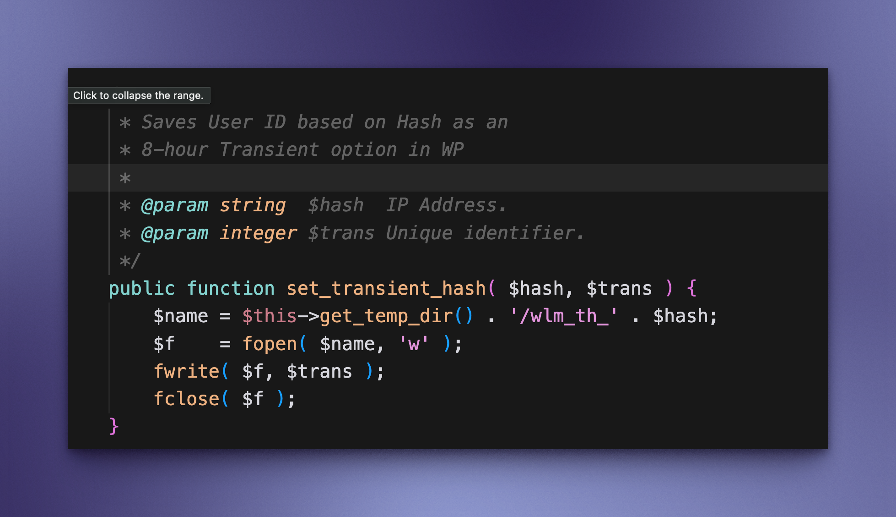
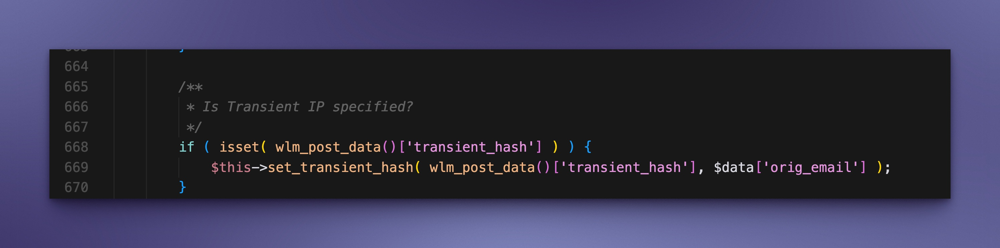

## Overview

This repository contains a detailed analysis of a vulnerability called **Unauthorized Arbitrary File Writing & Path Traversel** discovered in the **Wishlist Member** WordPress plugin. This vulnerability has already been patched without a CVE ID.

- **Affected Versions**: Version 3.25.1 and all earlier versions (i.e., 3.25.1 or earlier).

- **Severity**: High - This issue could lead to **Remote Code Execution (RCE)** if exploited.

The vulnerability exists in the user registration endpoint and allows an attacker to write arbitrary files to the server by manipulating specific POST parameters.

This report is intended for educational and responsible disclosure purposes. Sensitive information has been redacted to prevent misuse.

---

## Vulnerability Details

By sending a specially crafted `POST` request with the `transient_hash` operator to the `Path Traversel` of a temporary directory or the site root, and `orig_email`, code is placed that could cause code execution. An attacker could then control the file's path and contents.

- **Potential Impact/Risk of Remote Code Execution if the attacker knows the site root path and has appropriate write privileges**:

If an attacker manages to place the file in a web-accessible directory (such as the site root) and execute it, this could lead to **full remote code execution (RCE)**, allowing the attacker to run arbitrary commands on the server.

This issue was confirmed in **Wishlist Member version 3.25.1**, and earlier versions are likely also affected.

---

## Screenshots





> Note: Sensitive paths and server-specific data have been hidden.

--

## Proof of Concept (POC)

```http
POST /wishlist/register HTTP/1.1
Host: example.com
Content-Type: application/x-www-form-urlencoded

transient_hash=../../../username/public_html/info.php&orig_email=<?php phpinfo(); ?>
```

## Note
This vulnerability was discovered in Wishlist Member version 3.25.1 and earlier.

The vendor has patched it in a later release. A CVE identifier has not yet been assigned for this issue.
